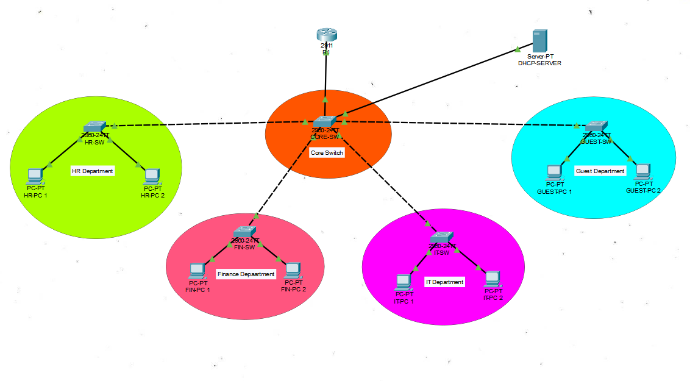

# CCNA Enterprise Network Project

## 📌 Project Overview

This project demonstrates the design and implementation of an enterprise network using Cisco Packet Tracer. The network is divided into multiple departments using VLANs with secure communication, centralized DHCP, SSH remote management, port security, and inter-VLAN routing.

The project is designed based on CCNA concepts to simulate a real-world enterprise network.

---

## 🛠 Technologies Used

- Cisco Packet Tracer
- Cisco Routers
- Cisco 2960 Switches
- VLAN
- Router-on-a-Stick
- DHCP
- SSH
- Port Security
- IEEE 802.1Q Trunking
- IPv4 Addressing

---

## 🏢 Network Topology

> Upload your topology image as **Topology.png** in this repository.



---

## 📋 VLAN Information

| VLAN ID | Department | Network |
|---------|------------|----------------|
| 10 | HR | 192.168.10.0/24 |
| 20 | Finance | 192.168.20.0/24 |
| 30 | IT | 192.168.30.0/24 |
| 40 | Guest | 192.168.40.0/24 |
| 50 | Server | 192.168.50.0/24 |
| 99 | Management | 192.168.99.0/24 |

---

## ✨ Features

- VLAN Segmentation
- Router-on-a-Stick Inter-VLAN Routing
- DHCP Configuration
- SSH Secure Remote Access
- Port Security
- 802.1Q Trunking
- Management VLAN
- Enterprise Network Design
- End-to-End Connectivity Testing

---

## 📂 Project Files

```
CCNA-Enterprise-Network-Project/
│
├── CCNA-Enterprise-Network.pkt
├── README.md
├── Topology.png
```

---

## ⚙ Configuration Summary

### VLAN Configuration

- VLAN 10 – HR
- VLAN 20 – Finance
- VLAN 30 – IT
- VLAN 40 – Guest
- VLAN 50 – Server
- VLAN 99 – Management

### Routing

Configured using **Router-on-a-Stick** with IEEE 802.1Q encapsulation.

### DHCP

Dynamic IP addresses are assigned to all VLANs using a DHCP server.

### SSH

SSH is configured on the Core Switch for secure remote management.

### Port Security

Port Security is enabled on access ports to prevent unauthorized access.

---

## ✅ Verification

- Successful VLAN communication
- Successful Inter-VLAN Routing
- DHCP IP Address Assignment
- SSH Remote Access
- Trunk Link Verification
- End-to-End Connectivity Testing

---

## 🎯 Skills Demonstrated

- Network Design
- VLAN Configuration
- Inter-VLAN Routing
- Switching
- DHCP
- SSH
- Port Security
- Cisco IOS Configuration
- Network Troubleshooting

---

## 🚀 Future Enhancements

- OSPF Dynamic Routing
- ACL Implementation
- NAT Configuration
- HSRP Redundancy
- Syslog Server
- SNMP Monitoring

---

## 👨‍💻 Author

**Karthikeyan**

Aspiring Network Engineer

### Skills

- CCNA
- Cisco Packet Tracer
- Routing & Switching
- VLAN
- DHCP
- SSH
- Port Security
- Git & GitHub

---

If you found this project useful, consider giving it a ⭐.
